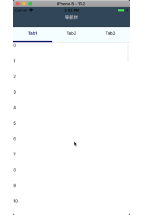

# react-native-collapsible

列表上、下滚动可以实现导航栏或者自定义header隐藏、显示的效果。

# 介绍 

因为此效果不易写成通用的组件，因此只写了一个demo。各位可以根据项目的需求进行定制。

## 效果

在安卓上会有一定的问题，因为安卓的onScroll和iOS的不同，需要一定时间完善。

| iOS | Android |
| --- | ------- |
|  | 暂无 |

# 实现

具体请Clone查看App.js和ListComponent.js

# 版本

0.0.1

